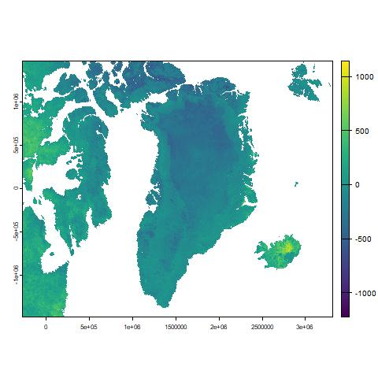

# Report multitemporal analysis by Markdown

In order to perform multitemporal analysis, datasets in different times can be important, by:

``` r
# 3 backticks per aprire una parte "codice"

im.list()
gr = im.import("greenland")

```

Once the set is being imported we can calculate the differences between different dates, as:

``` r
gr_dif = gr[[1]] - gr[[4]]

```

The output will be something like: 



.. per salire di un livello di cartello (non necessario nel mio caso)

> Note: information on the Copernicus program can be found at the [Copernicus page](https://www.copernicus.eu/it)


